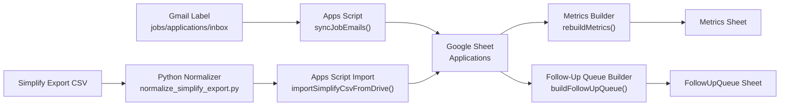

# Mahmoud Khafagy Job Funnel Automator

An automation-first job search tracking system that minimizes manual logging by combining:

- Gmail application-response ingestion (Google Apps Script)
- Simplify CSV normalization and batch import
- Google Sheets as a lightweight ATS-style pipeline dashboard

## Why this exists

Applying to jobs across multiple platforms creates fragmented tracking data and wasted follow-up opportunities. This project consolidates that data into one funnel with dedupe logic and stage tracking, so the focus stays on execution instead of admin work.

## Core features

- Auto-ingest job-related emails from a labeled Gmail inbox
- Extract company, role, and stage signals from email subject/body
- Dedupe entries using message IDs and stable fallback keys
- Import non-email applications from Simplify export CSVs
- Rebuild stage metrics in a `Metrics` sheet
- Generate a follow-up queue based on oldest untouched applications

## System Architecture



Pipeline summary:

1. Gmail labels route inbound job communications (confirmations, interviews, rejections).
2. `apps-script/Code.gs` parses each message and appends structured rows into `Applications`.
3. Simplify CSV exports are normalized with `scripts/normalize_simplify_export.py` and imported in batch.
4. Metrics and follow-up queues are rebuilt from a single source of truth.

## Screenshots

### Applications Pipeline View


### Metrics Snapshot


### Follow-Up Queue


Replace these placeholder images with real screenshots from your Google Sheet once your automation is running live.

## Data model (`Applications` sheet)

Columns created by automation:

1. `created_at_utc`
2. `source`
3. `company`
4. `role`
5. `stage`
6. `status`
7. `applied_date`
8. `external_id`
9. `email_subject`
10. `email_from`
11. `thread_url`
12. `notes`

## Setup

### 1) Google Sheet

Create a new Google Sheet and copy its Spreadsheet ID.

### 2) Apps Script

1. Open [script.new](https://script.new/) and paste `apps-script/Code.gs`.
2. Add `apps-script/appsscript.json` manifest values.
3. In **Project Settings -> Script Properties**, set:
   - `SPREADSHEET_ID` = your target sheet ID
   - `SOURCE_LABEL` = `jobs/applications/inbox`
   - `PROCESSED_LABEL` = `jobs/applications/processed`
   - `SEARCH_LIMIT` = `150`
4. Run `setupSheets()` once.
5. Run `syncJobEmails()` once to authorize Gmail + Sheets permissions.
6. Add a time-driven trigger for `syncJobEmails()` (hourly recommended).

### 3) Gmail labels

Create two labels:

- `jobs/applications/inbox`
- `jobs/applications/processed`

Route relevant inbound messages into `jobs/applications/inbox` using Gmail filters.

### 4) Simplify CSV pipeline

Normalize Simplify exports to a stable schema:

```bash
python3 scripts/normalize_simplify_export.py \
  --input /path/to/simplify_export.csv \
  --output /path/to/simplify_normalized.csv
```

Then import the normalized CSV through:

- Apps Script function `importSimplifyCsvFromDrive(fileId)`
- or paste rows directly into `Applications`

## Operational workflow

- Hourly: Gmail trigger ingests new labeled emails.
- Daily: run `rebuildMetrics()`.
- Weekly: run `buildFollowUpQueue(daysWithoutTouch, maxItems)` and process the queue.

## Security and privacy notes

- Do not store credentials in repo code.
- Use Script Properties for IDs/config.
- Keep this project private if your sheet includes personal contact details.

## Repo structure

- `apps-script/Code.gs` - Gmail/Sheets automation logic
- `apps-script/appsscript.json` - Apps Script manifest
- `scripts/normalize_simplify_export.py` - Simplify CSV normalizer
- `examples/simplify_export_sample.csv` - sample input schema
- `assets/screenshots/` - README gallery images (replace with real screenshots)

## Resume/project showcase angle

This project demonstrates:

- Practical workflow automation
- Data normalization across heterogeneous sources
- Lightweight ETL design and dedupe strategy
- Funnel analytics for operational decision-making
