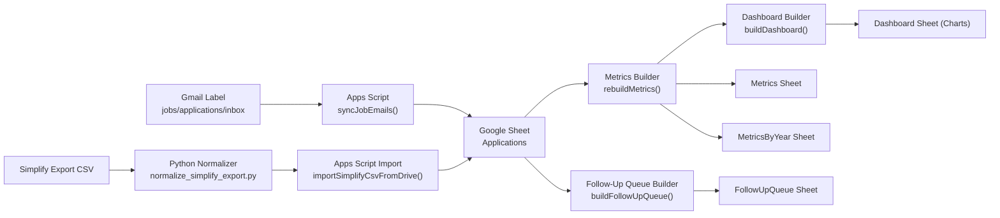
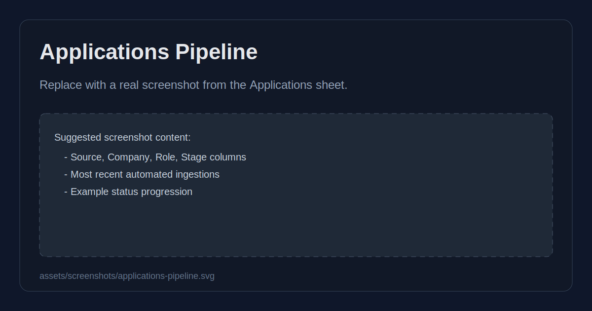
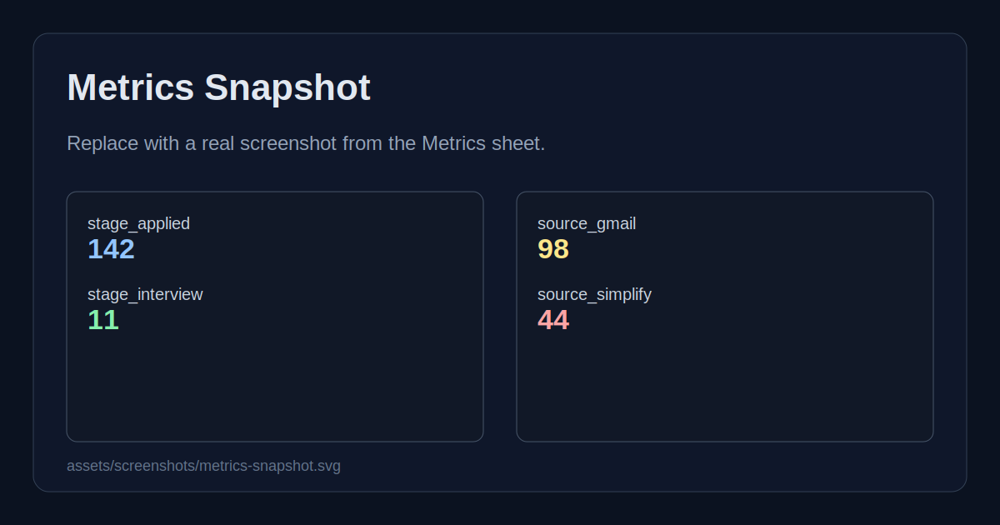
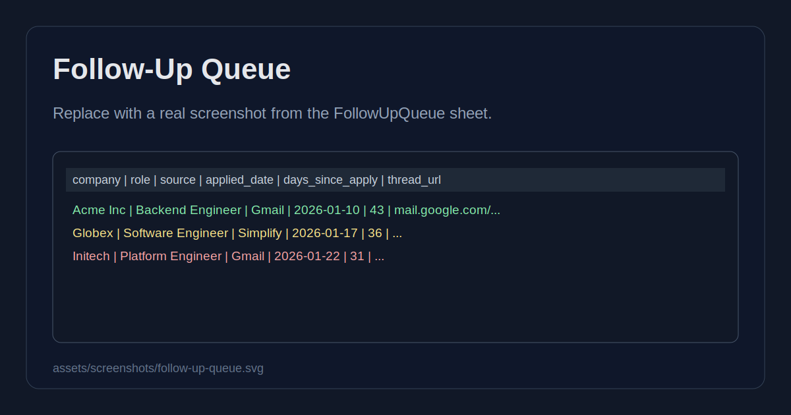

# Mahmoud Khafagy Job Funnel Automator

An automation-first job search tracking system that minimizes manual logging by combining:

- Gmail application-response ingestion (Google Apps Script)
- Simplify CSV normalization and batch import
- Google Sheets as a lightweight ATS-style pipeline dashboard

## Why this exists

Applying to jobs across multiple platforms creates fragmented tracking data and wasted follow-up opportunities. This project consolidates that data into one funnel with dedupe logic and stage tracking, so the focus stays on execution instead of admin work.

## Core features

- Auto-ingest job-related emails from a labeled Gmail inbox
- Extract company, role, and stage signals from email subject/body
- Dedupe entries using message IDs and stable fallback keys
- Import non-email applications from Simplify export CSVs
- Treat Simplify as primary for deduped application records
- Rebuild stage metrics in a `Metrics` sheet
- Break down metrics by year in `MetricsByYear` for easier auditing
- Auto-generate a visual dashboard (`Dashboard`) with charts
- Normalize `Updated` into `Applied` by default; stale updates become `Ghosted`
- Generate a follow-up queue based on oldest untouched applications

## System Architecture



Pipeline summary:

1. Gmail labels route inbound job communications (confirmations, interviews, rejections).
2. `apps-script/Code.gs` parses each message and appends structured rows into `Applications`.
3. Simplify CSV exports are normalized with `scripts/normalize_simplify_export.py` and imported in batch.
4. Metrics and follow-up queues are rebuilt from a single source of truth.

Deduplication model:

- Simplify rows are treated as the primary application record when overlap exists.
- Gmail is used to capture additional applications that are not already represented by Simplify.
- Canonical analytics (metrics/dashboard/follow-up) operate on deduped records.

## Screenshots

### Applications Pipeline View



### Metrics Snapshot



### Metrics By Year

`MetricsByYear` stores rows in the form:

- `year`
- `metric`
- `value`

This makes it easy to audit stage inflation by year (for example `year_2025_stage_interview` vs `year_2026_stage_interview` in the flattened `Metrics` sheet, plus explicit yearly rows in `MetricsByYear`).

`Dashboard` includes these charts:

- Stage Distribution
- Source Distribution
- Yearly Stage Counts (Stacked)
- Applications Over Time (Monthly)
- Interview vs Applied by Year
- Current Year Monthly Funnel

Meaning of `Yearly Stage Counts (Stacked)`:

- X-axis: year
- Y-axis: count of deduped application records
- Each color: stage bucket count for that year

### Follow-Up Queue



Replace these placeholder images with real screenshots from your Google Sheet once your automation is running live.

## Data model (`Applications` sheet)

Columns created by automation:

1. `created_at_utc`
2. `source`
3. `company`
4. `role`
5. `stage`
6. `status`
7. `applied_date`
8. `external_id`
9. `email_subject`
10. `email_from`
11. `thread_url`
12. `notes`

## Setup

### 1) Google Sheet

Create a new Google Sheet and copy its Spreadsheet ID.

### 2) Apps Script

1. Open [script.new](https://script.new/) and paste `apps-script/Code.gs`.
2. Add `apps-script/appsscript.json` manifest values.
3. In **Project Settings -> Script Properties**, set:
   - `SPREADSHEET_ID` = your target sheet ID
   - `SOURCE_LABEL` = `jobs/applications/inbox`
   - `PROCESSED_LABEL` = `jobs/applications/processed`
   - `SEARCH_LIMIT` = `150`
   - `GHOSTED_DAYS` = `45` (optional; `Updated` older than this is counted as `Ghosted`)
4. Run `setupSheets()` once.
5. Run `syncJobEmails()` once to authorize Gmail + Sheets permissions.
6. Add a time-driven trigger for `syncJobEmails()` (hourly recommended).
7. For first-time backfill, run `syncJobEmails()` manually a few times until pending labeled messages are drained.
8. Run `buildDashboard()` once (or use the menu item `Job Funnel -> Build Dashboard`).

### 3) Gmail labels

Create two labels:

- `jobs/applications/inbox`
- `jobs/applications/processed`

Route relevant inbound messages into `jobs/applications/inbox` using Gmail filters.

### 3.1) Recommended Gmail filter (stable baseline)

Use Gmail advanced search to create one filter with:

- Action:
  - `Apply label` -> `jobs/applications/inbox`
  - `Never send it to Spam`

- Has the words:

```text
("thank you for applying" OR "application received" OR "application submitted" OR "update on your application" OR "next steps" OR "phone screen" OR "technical screen" OR "online assessment" OR "coding assessment" OR "take-home" OR "take home" OR "interview" OR "job offer" OR "offer letter" OR "not moving forward" OR rejection)
OR from:(greenhouse.io OR lever.co OR myworkday.com OR workday.com OR ashbyhq.com OR smartrecruiters.com OR icims.com OR jobvite.com OR taleo.net OR hirevue.com OR codesignal.com OR hackerrank.com OR jobdiva.com)
```

- Doesn't have:

```text
from:(paypal.com OR disneydebit.com OR chase.com OR capitalone.com OR wellsfargo.com OR bankofamerica.com OR citi.com OR discover.com OR americanexpress.com OR linkedin.com OR otp.workday.com OR statefarm.com)
OR subject:("job alert" OR "daily job alert" OR "weekly job alert" OR "jobs you may be interested in" OR "reset your password" OR "password reset" OR otp OR "security code" OR "verify your email" OR "account verification" OR newsletter OR "virtual recruiter" OR "now on mobile" OR "current openings" OR "get the app")
```

Notes:

- Keep this query in `Has the words`/`Doesn't have` filter fields instead of only raw search bar strings for better maintainability.
- `subject:` only checks subject line; plain quoted phrases in `Has the words` can match body text too.
- Review false positives weekly and append exclusions (`-from:domain.com` or `-subject:"phrase"`).

### 4) Simplify CSV pipeline

Normalize Simplify exports to a stable schema:

```bash
python3 scripts/normalize_simplify_export.py \
  --input /path/to/simplify_export.csv \
  --output /path/to/simplify_normalized.csv
```

Then import the normalized CSV through:

- Apps Script function `importSimplifyCsvFromDrive(fileId)`
- or paste rows directly into `Applications`

When imported via Apps Script, Simplify rows upsert existing matches and reduce cross-source duplicates.

## Operational workflow

- Hourly: Gmail trigger ingests new labeled emails.
- Daily: run `rebuildMetrics()`.
- Daily (optional): run `buildDashboard()` if you want a manual visual refresh. (`rebuildMetrics()` also rebuilds dashboard automatically.)
- Weekly: run `buildFollowUpQueue(daysWithoutTouch, maxItems)` and process the queue.

Current-year monthly view:

- `CurrentYearStats` sheet is rebuilt by dashboard generation.
- This is the primary month-by-month operational view for the current year.

Quick operational checks:

1. Pending items (not yet processed):

```text
label:"jobs/applications/inbox" -label:"jobs/applications/processed"
```

2. Recent labeled traffic:

```text
label:"jobs/applications/inbox" newer_than:2d
```

## Security and privacy notes

- Do not store credentials in repo code.
- Use Script Properties for IDs/config.
- Keep this project private if your sheet includes personal contact details.

## Known limitations

- Heuristic parsing can leave `company` or `role` as `Unknown` for noisy templates.
- Broad keywords (for example "offer" or "recruiter") can cause false positives if filter exclusions are too weak.
- This pipeline does not capture non-email applications unless you import CSV/manual rows.
- Metrics are deduped to approximate one-row-per-application using company/role/date keys plus source preference.

## Troubleshooting

1. `syncJobEmails` runs but no rows are appended:
   - Confirm script properties are set (`SPREADSHEET_ID`, `SOURCE_LABEL`, `PROCESSED_LABEL`, `SEARCH_LIMIT`, `GHOSTED_DAYS`).
   - Confirm pending Gmail results exist:
     - `label:"jobs/applications/inbox" -label:"jobs/applications/processed"`

2. Gmail filter appears to miss expected messages:
   - If phrase is only in body, do not wrap it with `subject:`.
   - Validate in search first with:
     - `in:anywhere "thank you for applying" newer_than:7d`

3. Data quality is noisy:
   - Tighten `Doesn't have` exclusions.
   - Run weekly cleanup by removing label from obvious non-job threads.

## Repo structure

- `apps-script/Code.gs` - Gmail/Sheets automation logic
- `apps-script/appsscript.json` - Apps Script manifest
- `scripts/normalize_simplify_export.py` - Simplify CSV normalizer
- `examples/simplify_export_sample.csv` - sample input schema
- `assets/screenshots/` - README gallery images (replace with real screenshots)

## Resume/project showcase angle

This project demonstrates:

- Practical workflow automation
- Data normalization across heterogeneous sources
- Lightweight ETL design and dedupe strategy
- Funnel analytics for operational decision-making
